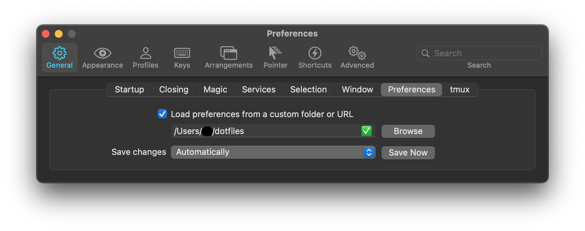

# dotfiles


[](https://github.com/konumaru/dotfiles/actions/workflows/monthly-backup.yml)

## Install required tools

- Command line tools for xcode
- [Homebrew](https://brew.sh/index_ja)
- [Zinit](https://github.com/zdharma/zinit)
- [Tmux Plugin Manager](https://github.com/tmux-plugins/tpm)
- [dein.vim](https://github.com/Shougo/dein.vim)

## Usage

### mac 
```sh
bash -c "$(curl -L https://raw.githubusercontent.com/konumaru/dotfiles/main/bin/setup.sh)"
```

### Windows
```
Invoke-Expression '$(Invoke-WebRequest heetps://raw.githubusercontent.com/konumaru/dotfiles/main/test.bat -UseBasicParsing)'
```

## Description for setting files

- [Homebrew](Brewfile)
- [iterm2](com.googlecode.iterm2.plist)
  - 
- zsh
  - [zshrc](.zshrc)
  - [zprofile](.zprofile)
- [neovim](nvim)
